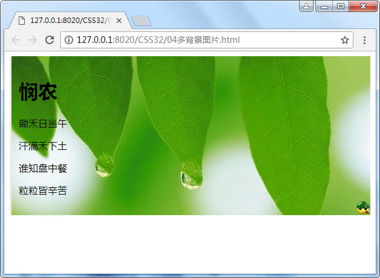

## 1、CSS的发展历程

​	从HTML被发明开始，样式就以各种形式存在，不同的浏览器结合他们各自的样式语言为用户提供页面效果的控制。最初的HTML只包含很少的显示属性。

​	随着HTML的成长，为了满足页面设计者的需求，HTML添加了很多显示功能。但是随着这些功能的增加，HTML变得越来越杂乱，而且HTML页面也越来越臃肿，于是CSS便诞生了。

​	CSS用于控制网页的样式和布局, 修饰页面效果，可以配合脚本语言动态的对网页各元素进行格式化，在提升用户体验方面功不可没。

> - CSS1： W3C 推荐，CSS1 发布于 1996 年 12 月 17 日。1999 年 1 月 11 日，此推荐被重新修订。
> - CSS2：W3C 推荐，CSS2 发布于 1999 年 1 月 11 日。CSS2 添加了对媒介（打印机和听觉设备）和可下载字体的支持。
> - CSS3：将 CSS 划分为多个小模块:盒子模型、列表模块、超链接方式 、语言模块 、背景和边框 、文字特效 、多栏布局等。

## 2、CSS网页的美容师

CSS的出现，拯救了混乱的HTML，也拯救了我们web开发者，让我们的网页更加丰富多彩。

CSS最大的贡献就是：让HTML从样式中脱离苦海，实现了HTML专注做结构，样式使用CSS来实现。

如果JavaScript是网页的魔法师，那么CSS就是网页的美容师。


有人说：没有不漂亮的女人，只有不会打扮的女人。

我想说：没有不好看的网页，只有不会CSS的前端


网页添加CSS和不添加CSS的对比：

带有CSS的页面：


没有CSS的页面：


理解：

HTML-->生活：房子、家电等东西。
CSS-->生活：装修房子、布局家电家具等。


## 3、CSS初识

CSS(Cascading Style Sheets的缩写)

CSS通常称为CSS样式表或层叠样式表（级联样式表），主要用于设置HTML页面中的文本内容（字体、大小、对齐方式等）、图片的外形（宽高、边框样式、边距等）以及版面的布局等外观显示样式。

CSS以HTML为基础，提供了丰富的功能，如字体、颜色、背景的控制及整体排版等。而且还可以针对不同的浏览器设置不同的样式。


## 4、CSS样式规则

使用CSS时，需要了解CSS样式规则，具体格式如下：

CSS规则主要由两个主要部分构成：选择器，以及一条或多条声明。


> 在上面的样式规则中：
>
> 1. 选择器用于指定css样式作用的HTML对象，花括号内是对该对象设置的具体样式。
> 2. 属性和属性值之间以“键值对”的形式出现。
> 3. 属性是对指定的对象设置的样式属性，例如字体大小、文本颜色等。
> 4. 属性和属性值之间用英文“：”连接。
> 5. 多个键值对之间使用英文“；”区分。

示例

~~~css
h1 {  /*选择器*/
    color: red;	/*声明*/
    font-size: 14px;  /*声明*/
}
~~~


**CSS3 选择器分类**

根据所获取页面中元素的不同，把 CSS3 选择器分为五大类：基本选择器、层次选择器、伪类选择器、伪元素和属性选择器。其中，伪类选择器又分为六种：动态伪类选择器、 目标伪类选择器、语言伪类、UI 元素状态伪类选择器，结构伪类选择器和否定伪类选择器， 如下图所示。

 


本文在第10部分对"基本选择器"和常用的"动态伪类、目标伪类、结构伪类、否定伪类选择器"进行了介绍；在第11部分"CSS复合选择器"中对"层次选择器"、"属性选择器"、"伪元素选择器"进行了介绍。


## 5、CSS引入方式

#### 5.1 行内样式表

直接在标签的属性中使用style声明，在style属性中添加css声明即可。

由于要将表现和内容混杂在一起，行内样式表会损失掉样式表的许多优势。请慎用这种方法，例如当样式仅需要在一个元素上应用一次时。

~~~html
<!--在标签内部再嵌套一个内嵌标签来设置样式-->
<h1>这是一个<span style="color: red;">行内样式表</span>的css</h1>
~~~


#### 5.2 内部样式表

定义在head或body标签中,使用style标签.

当单个文档需要特殊的样式时，就应该使用内部样式表。

~~~css
/*内部定义的style样式*/
<style type="text/css">
	h1 {
        background-color: deeppink;
        color: blue;
	}
</style>

~~~


#### 5.3 外部样式表

定义在外部的css文件中，需要在head中引入相应的css文件

当样式需要应用于很多页面时，外部样式表将是理想的选择。在使用外部样式表的情况下，你可以通过改变一个文件来改变整个站点的外观。每个页面使用\<link> 标签链接到样式表。

（1）**html文件中：使用link来导入css文件**

~~~css
/*关联外部的css样式文件*/
<link type="text/css" rel="stylesheet" href="../css/test.css" />

type:定义链接文档的类型，在这里需要指定为"text/css",表示链接的外部文件为css样式表。
rel：定义当前文档与被链接文档之间的关系，在这里需要指定为"stylesheet"，表示被链接的文档是一个样式表文件。
href：定义所链接外部样式表文件的url，可以是相对路径，也可以是绝对路径。
~~~

（2）**css文件中：定义CSS样式**

~~~css
h1{
	background-color: rosybrown;
	color: #0000FF;	
}
~~~


#### 5.4 三种样式表总结

|     样式表     |           优点           |           缺点           |    使用情况    |      控制范围      |
| :------------: | :----------------------: | :----------------------: | :------------: | :----------------: |
| **行内样式表** |     书写方便，权重高     | 没有实现结构与样式相分离 |      较少      | 控制一个标签（少） |
| **内部样式表** |   部分结构和样式相分离   |       没有彻底分离       |      较多      | 控制一个页面（中） |
| **外部样式表** | 完全实现结构和样式相分离 |         需要引入         | 最多，强烈推荐 | 控制整个站点（多） |

优先级：

- 优先级是指最终哪个样式规则作用于指定元素； 
- 就近原则；
- 理论：行内>内嵌>引入；
- 实际：内嵌、导入在同一个文件头部，谁离的近谁的优先级高；


## 6、开发者工具（chrome）

此工具是我们的必备工具，以后代码除了问题，我们首先想到的应该是：

按“F12”或者“shift+ctrl+i”或者“右击网页空白处-->检查” 打开开发者工具。


**小技巧**：

1、Ctrl+滚轮可以放大开发者工具代码大小。

2、左边是HTML元素结构，右边是CSS样式。

3、右边CSS样式可以改动数值和颜色，并实时查看更改后的效果


## 7、CSS字体属性

#### 7.1 font-size：字号大小

~~~html
<style>
	h1 {
		font-size: 40px;
	}
	h2 {
		font-size: 30px;
	}
	p {
		font-size: 14px;
	}
</style>

<h1>This is heading 1</h1>
<h2>This is heading 2</h2>
<p>This is a paragraph.</p>
~~~


| 相对长度单位 | 说明                           |
| :----------: | ------------------------------ |
|    **em**    | 相对于当前对象内文本的字体尺寸 |
|    **px**    | 像素                           |

- **em**

  em：相对长度单位。相对于当前对象内文本的字体尺寸。如当前行内文本的字体尺寸未被人为设置，则相当于浏览器的默认字体尺寸。1em=16px

- **px**

  px：像素（Pixel）,相对于设备的长度单位，像素是相对于显示器屏幕分辨率而言的。譬如，WINDOWS的用户所使用的分辨率一般是96像素/英寸。而MAC的用户所使用的分辨率一般是72像素/英寸。

  

#### 7.2 font-family：字体

[字体对比网](https://www.fontke.com/)

font-family属性用于设置字体。网页中常用的字体有宋体、微软雅黑、黑体等。例如将网页中所有段落文本的字体都设置为微软雅黑，可以使用如下CSS样式代码：

~~~css
p {
    font-family:"微软雅黑","黑体","宋体";
}
/*可以同时指定多个字体，中间以逗号隔开，表示如果浏览器不支持第一个字体，则会尝试下一个，直到找到合适的字体*/
~~~

常用技巧：

> 1. 现在网页中普遍使用14px+。
> 2. 尽量使用偶数的数字字号，ie6等老式浏览器支持奇数会有bug。
> 3. 各种字体之间必须使用英文状态下的逗号“,”分隔。
> 4. 中文字体需要加英文状态下的引号，英文字体一般不需要加引号。当需要设置英文字体时，英文字体名必须位于中文字体名之前。例如：font-family: Arial, "微软雅黑"; 。
> 5. 如果字体名中包含空格、#、$等符号，则该字体必须加英文状态下的单引号或双引号，例如：font-family: "Times New Roman";。
> 6. 尽量使用系统默认字体，保证在任何用户的浏览器中都能正确显示。
> 7. 英文字体要写在中文字体之前
>
> 
>

##### 补充说明：

在日常工作中，一般我们都需要用到英文字体，而如这篇文章所说，首选是**Arial**。

但是，我在实际工作中不会推荐使用这个字体，一般来说，主体的字体，首选是**Tahoma**，其次是**Helvetica**。一般windows系统会自带**Tahoma**字体，根据我细微的观察，我觉得它比**Arial**要更加好看一些。而**Helvetica**是苹果系统的标配，而且确实感觉不错。

而在一些比较大的数字上面，我会使用**Georgia**字体。这种字体显得比较屌，很多大站也是这么做的。

等宽字体推荐使用**Consolas**适用于`pre` `code`等地方。

而英文的引用或者导读，我推荐使用**Times New Roman** 字体，这种**衬线字体**在大段**无衬线字体**中显得比较显眼。

中文统一使用**微软雅黑**就好了。

#### 7.3 CSS Unicode字体

在CSS中设置字体名称，是可以直接写中文的。但是在文件编码（GB2312、utf-8等）不匹配时会产生乱码的错误。xp系统不支持类似“微软雅黑”的中文。

方案一：可以使用英文来替代，比如：font-family:"Microsoft Yahei"; 。

方案二：在CSS中直接使用Unicode编码来写字体名称可以避免这些错误。使用Unicode写中文字体名称，浏览器是可以正确解析的。比如：font-family:"\5FAE\8F6F\96C5\9ED1",表示设置字体为“微软雅黑”。

| 字体名称          | 英文名称            | Unicode编码            |
| ------------- | --------------- | -------------------- |
| **宋体**        | Simsun          | \5B8B\4F53           |
| **新宋体**       | NSimsun         | \65B0\5B8B\4F53      |
| **黑体**        | SimHei          | \9ED1\4F53           |
| **微软雅黑**      | Microsoft YaHei | \5FAE\8F6F\96C5\9ED1 |
| **楷体_GB2312** | KaiTi_GB2312    | \6977\4F53_GB2312    |
| **隶书**        | LiSu            | \96B6\4E66           |
| **幼圆**        | YouYuan         | \5E7C\5706           |
| **华文细黑**      | STXihei         | \534E\6587\7EC6\9ED1 |
| **细明体**       | MingLiU         | \7EC6\660E\4F53      |
| **新细明体**      | PMingLiU        | \65B0\7EC6\660E\4F53 |

#### 7.4 font-weight：字体粗细

字体加粗除了用 b 和 strong 标签外，还可以使用CSS来实现，但CSS是没有语义的。

~~~
font-weight属性用于定义字体的粗细，其可用属性值：bolder、bold、normal、lighter、100~900（100的整数倍）。
~~~

~~~html
<style type="text/css">
	p {
		font-weight: normal;
	}
	div {
		font-weight: bold;
	}
	span {
		font-weight: bolder;
	}
</style>

<p>这是normal的文本</p>
<div>这是bold的文本</div>
<span>这是bolder的文本</span>
~~~

小技巧：

~~~css
数字 400 等价于 normal， 而 700 等价于 bold。
~~~


#### 7.5 font-style：字体风格

字体倾斜除了用 i 和 em 标签外，可以使用CSS实现，但CSS是没有语义的。

font-style属性用于定义字体风格，如设置斜体、倾斜或正常字体，其可用属性值如下：

- **normal**：默认值，浏览器会显示标准的字体样式。

- **italic**：浏览器会显示斜体的字体样式。

- **oblique**：浏览器会显示倾斜的字体样式。

~~~html
<style>
	p {
		font-style: normal;
	}		
	div {
		font-style: italic;
	}		
	span {
		font-style: oblique;
	}
</style>

<p>这是一个段落,正常。</p>
<div>这是一个段落,斜体。</div>
<span>这是一个段落,斜体。</span>
~~~

小技巧：

平时我们很少给文字加斜体，反而是给斜体标签（i，em）改为普通模式。


#### 7.6 font综合设置字体样式

font属性用于对字体样式进行综合设置，其基本语法如下：

~~~css
选择器 {
    font： font-style  font-weight  font-size/line-height  font-family;
}

注意：使用font属性时，必须按照上面语法格式中的顺序书写，不能更换顺序，各个属性以空格隔开。
	其中不需要的属性可以省略（取默认值），但必须保留font-size、font-family属性，否则font属性将不起作用。
~~~

~~~html
<style type="text/css">
	p{
		font: italic bold 12px/30px Georgia, serif;
	}
</style>

<p>这是一个设置了字体样式的文本</p>
~~~

## 8、CSS文本属性

#### 8.1 color 文本颜色

color属性用于指定文本的颜色，有3种表现形式。

- color-name：使用颜色名称，如：red
- hex-number：使用十六进制数表示，取值时0~f，每个颜色使用两位表示，如：#ff0000；

​                                 如果颜色值每两位都是相同的，可以简写为一位，比如：#ff0000可以简写为 #f00；

​                                 aabbcc可以简写为 #abc，#aabb12  这种情况就不能简写了；

​                                 要么是6位要么是3位。

- rgb-number：使用rgb颜色值表示，取值0~255，如rgb(255,0,0)，rgba(100%, 0%, 0%, 50%)

  需要注意的是，如果使用RGB代码的百分比颜色值，取值为0时也不能省略百分号，必须写为0%。

~~~html
<style type="text/css">
	h1 {
		color: red;
	}
	h2 {
		color: #00ff00;
	}
	h3 {
		color: rgb(0, 0, 255);
	}
</style>

<h1>标题1</h1>
<h2>标题2</h2>
<h3>标题3</h3>
~~~


#### 8.2 text-align 文本对齐方式

text-align用于指定块级元素文本的水平对齐方式，取值有left、right、center、justify（两端对齐文本）

~~~html
<style type="text/css">
	h1 {
		text-align: left;	/*左对齐*/
	}
	h2 {
		text-align: center;	/*居中对齐*/
	}
	h3 {
		text-align: right; /*右对齐*/
	}
	p {
		text-align: justify; /*分散对齐，主要针对英文段落中出现空格时，由于两边对齐，空格的大小会有变化  感觉没什么用*/
	}
</style>

<h1>标题1</h1>
<h2>标题2</h2>
<h3>标题3</h3>

<p>当我年轻的时候，我梦想改变这个世界；当我成熟以后，我发现我不能够改变这个世界，我将目光缩短了些，决定只改变我的国家；当我进入暮年以后，我发现我不能够改变我们的国家，我的最后愿望仅仅是改变一下我的家庭，但是，这也不可能。当我现在躺在床上，行将就木时，我突然意识到：如果一开始我仅仅去改变我自己，然后，我可能改变我的家庭；在家人的帮助和鼓励下，我可能为国家做一些事情；然后，谁知道呢?我甚至可能改变这个世界。”</p>
	
~~~


#### 8.3 text-decoration 文本修饰

text-decoration用于对文本添加修饰，如下划线、删除线等。有如下取值：

- none：默认，定义标准的文本，没有任何修饰。
- underline：定义在文本下方的一条线
- overline：定义在文本上方的一条线
- line-through：定义穿过文本的一条线
- blink：定义闪烁的文本

~~~html
<style type="text/css">
	h1 {
		text-decoration: none;
	}
	h2 {
		text-decoration: overline;
	}		
	h3 {
		text-decoration: line-through;
	}		
	h4 {
		text-decoration: underline;
	}
	h5 {
		text-decoration: blink;
	}
</style>
~~~

**使用技巧**：text-decoration: none; 去掉超链接标签a标签的下划线。


#### 8.4 text-transform 文本转换

text-transform用于转换文本的大小写（主要用于英文），其取值有：

- none：默认
- capitalize：文本中每个单词以大写字母开头
- uppercase：所有单词字母都大写
- lowercase：所有单词字母都小写

~~~html
<style>
	h1 {text-transform:uppercase;}
	h2 {text-transform:lowercase;}
	h3 {text-transform:capitalize;}
</style>
~~~


#### 8.5 text-indent 文本缩进

text-indent 属性规定文本块中首行文本的缩进。取值有：

- 数值：表示像素值
- 百分比：基于父元素宽度的百分比的缩进。

**注意：** 负值是允许的。如果值是负数，将第一行左缩进。

~~~html
<style>
	p {
        text-indent:50px;
    }
</style>

<!-- 小技巧： 首行缩进2字符使用 2em -->
~~~


#### 8.6  text-shadow 文本阴影

text-shadow用于设置文本的阴影效果。语法格式是

~~~html
text-shadow: h-shadow v-shadow blur color;
~~~

- h-shadow：必需。水平阴影的位置。允许负值。horizontal
- v-shadow：必需。垂直阴影的位置。允许负值。 vertical
- blur：可选。模糊的距离。
- color：可选。阴影的颜色。

~~~html
<style type="text/css">
	h1 {
		text-shadow: 2px 2px #FF0000;
	}	
	h2 {
		text-shadow: 2px 2px 8px #FF0000;
	}		
	h3 {
		color: white;
		text-shadow: 2px 2px 4px #000000;
	}		
	h4 {
		text-shadow: 0 0 3px #FF0000;
	}
</style>
~~~


#### 8.7 direction 文本方向

direction 用于指定块级文本的方向。取值如下：

ltr：默认的，文本方向从左到右 left to right

rtl：文本方向从右到左。right to left

~~~html
<style type="text/css">
	p {
		direction: ltr;
	}		
	div {
		direction: rtl;
	}
</style>
~~~

需要注意的是如果是设置rtl属性的时候文字的前后顺序是不变的 ，如果需要文字方向改变，则需要加unicode-bidi属性

```css
div 
{
     direction: rtl;
     unicode-bidi:bidi-override;
}
```


#### 8.8 letter-spacing 字符间距

letter-spacing 属性增加或减少字母/汉字间的空白（字符间距），使用数值表示，可以是负数。

~~~html
<style>
	h1 {
        letter-spacing:2px;
  	}
	h2 {
      	letter-spacing:-3px;
  	}
</style>
~~~


#### 8.9 word-spacing 字间距

word-spacing属性增加或减少单词之间的空白（如果文本中没有出现空白符，该属性不起作用 ），允许使用负值。

~~~html
<style>
  p{ 
      word-spacing:30px;
  }
</style>
<p>
    Age has reached the end of the beginning of a word. May be guilty in his seems to passing a lot of different life became the appearance of the same day; May be back in the past, to oneself the paranoid weird belief disillusionment, these days, my mi
</p>
~~~


#### 8.10 line-height 行高

line-height 用于设置行高。取值如下：

- number：设置数字，此数字会与当前的字体尺寸相乘来设置行间距。

- length：设置固定的行间距。

- %：基于当前字体尺寸的百分比行间距。

  注意：一般情况下，行距比字号大7 8像素即可。

~~~html
<style>
    span {
    	line-height:2;
    }
    p {
        line-height:20px;
    }
    div {
        line-height:100%;
    }
</style>
~~~

**使用技巧**：在一行的盒子内，我们设定行高等于盒子的高度，就可以使文字垂直居中。

#### 8.11 综合案例

案例一：


分析：宽、高、边框border: 1px solid black、字体大小、水平居中、垂直居中、字体，字间距


## 9、CSS注释

~~~css
css规则是使用  /*需要注释的内容*/ 进行注释的。例如：
p {
    font-size: 14px;	/*设置字体的大小是14像素*/
}
~~~

## 10、基本选择器（重点）与伪类选择器

要想将CSS样式应用于特定的HTML元素，首先需要找到该目标元素。在CSS中，执行这一任务的样式规则部分被称为选择器。


#### 10.1 标签选择器（元素选择器）

标签选择器是指用HTML标签名作为选择器，按标签名称分类，为页面中某一类标签指定统一的CSS样式。其基本语法格式如下：

~~~
标签名{属性1：属性值1; 属性2：属性值2; ...}
~~~

标签选择器最大的优点是能快速为页面中同类型的标签统一样式，同时这也是它的缺点，不能设计差异化样式。

示例：

~~~css
h1 {
    color: red;
}

p {
    color: green;
}
~~~


#### 10.2 id选择器

id选择器使用“**#**”进行标识，后面紧跟id值，基本语法格式如下：

```html
#id值{属性1：属性值1; 属性2：属性值2; ...}

<标签名 id="id值"></标签名>
```

该语法中，id名即为HTML元素的id属性值，大多数HTML元素都可以定义id属性，元素的id值是唯一的，只能对应于文档中某一个具体的元素。用法基本与类选择器相同。

```html
<div class="lin">林黛玉</div>	<!-- 使用类选择器 -->
<div id="xue">薛宝钗</div>		<!-- 使用id选择器 -->
```

```css
<style>
	.lin {			/*类选择器， 在元素中使用class属性*/
		color: blue;
	}
	#xue {			/*id选择器， 在元素中使用id属性*/
		color: red;
	}
</style>
```


#### 10.3 类选择器

类选择器使用“**.**”（英文点）进行标识，后面紧跟类名，其基本语法格式如下：

~~~HTML
定义：
.类名{属性1：属性值1; 属性2：属性值2; ...}

调用：
<标签名 class="类名"></标签名>
~~~

类选择器最大的优势是可以为元素对象定义单独或相同的样式。

示例：

```html
<div class="demo">这是一个div</div>
```

```css
.demo {
    color: red;
}
```

小技巧：

> 1. 长名称或词组可以使用中横线来为选择器命名。 bg-color
>
>
> 2. 不建议使用“_”下划线来命名CSS选择器。
>    1. 浏览器兼容问题
>    2. 能良好区分Javascript变量命名（JS变量命名使用下划线“_”）
> 3. 不要纯数字、中文等命名，尽量使用英文字母来表示。见名知意


**课堂案例**：

案例一：使用类选择器实现如下效果


分析：字体大小，字体，字颜色


案例二：使用类选择器实现如下效果，创建一个奇特的表


分析：边框合并（border-collapse: collapse;）、行背景、边框颜色（border-color）、背景色（background-color）、文本左对齐、文字颜色；

#### 10.4 多类名选择器

我们可以给标签指定多个类名，从而达到更多的选择目的。

```html
<!--在class属性中使用多个类名，表示同时满足多个样式 -->
<div class="font20 red fontWeight">西游记</div> 
<div class="font20">红楼梦</div>
<div class="font14 fontWeight">三国演义</div>
<div class="font14">水浒传</div>
```

~~~css
<style>
	.font20 {
		font-size: 20px;
	}
	.font14 {
		font-size: 14px;
	}
	.red {
		color: red;
	}
	.fontWeight {
		font-weight: bold;
	}
</style>
~~~


注意：

> 1. 样式显示效果跟HTML元素中的类名先后顺序没有关系，受CSS样式书写的上下顺序有关。
> 2. 各个类名中间用空格隔开

多类名选择器在后期布局较为复杂的情况下使用较多。


#### 10.5 id选择器和类选择器区别

W3C标准规定，在同一个页面内，不允许有相同值的id对象出现，但是允许相同值的class。

类选择器（class）好比人的名字，可以重复使用，如：李伟、张伟

id选择器（id）好比人的身份证号，是唯一的，不允许重复，只能使用一次。


#### 10.6 通配符选择器

通配符选择器用“*****”号表示，它是所有选择器中作用范围最广的，能匹配页面中所有的元素。其基本语法格式如下：

~~~
* {属性1：属性值1; 属性2：属性值2; ...}
~~~

例如下面的代码，使用通配符选择器定义CSS样式，清除所有HTML元素的默认边距。

~~~css
* {
    margin: 0;	/*定义外边距*/
    padding: 0;	/*定义内边距*/
}
~~~

**使用技巧**：通配符选择器可清除浏览器默认样式。


#### 10.7 伪类选择器

伪类选择器（简称：伪类）通过冒号来定义，它定义了元素的状态，如点击按下，点击完成等，通过伪类可以为元素的状态修改样式。 

#####(1)链接伪类选择器

链接伪类选择器主要针对于a标签，也称动态伪类选择器

~~~css
a:link		/*未访问的链接*/
a:visited	/*已访问的链接*/
a:hover		/*鼠标移动到链接上*/
a:active	/*选定的链接*/
~~~

注意：

> 1. a:hover 必须在 a:link 和 a:visited 之后。
> 2. a:active 必须在 a:hover 之后，需要严格按顺序才能看到效果。

所以，写的时候顺序尽量不要颠倒，按照**l** o **v** e  **h** **a **t e来记忆

也可以这样啦记忆: lvha 

```css
<style>
	a:link {		/*未访问的链接*/
		font-size: 16px;
		color: grey;
		font-weight: 700;
	}
	a:visited {		/*已访问的链接 表示已经点击过一次的状态*/
		font-size: 16px;
		color: orange;
		font-weight: 700;
	}
	a:hover {		/*鼠标移动到链接上*/
		font-size: 16px;
		color: red;
		font-weight: 700;
	}
	a:active {		/*选定的链接  鼠标点击不松开的状态*/
		font-size: 16px;
		color: blue;
		font-weight: 700;
	}
</style>
```

实际工作中，链接伪类选择器使用简写即可。

~~~css
a {		/*a是标签选择器，所有的链接*/
	font-weight: 700;
	font-size: 16px;
	color: grey;
}
a:hover {	/*:hover 是链接伪类选择器 鼠标移动到链接上*/
	color: red;		/*鼠标经过时，文本由原来的灰色变为红色*/
}
~~~

 div、p--hover 

##### (2)UI元素状态伪类

指定的样式只有当元素处于某种状态时才起作用，在默认状态下不起作用

-  **E:focus （用户行为选择器）**： 选择匹配的E元素，而且匹配元素获取焦点(动态伪类），实际工作中常用于去除默认边框线 :focus{outline:none;}
- E:checked（选中状态伪类选择器）：匹配选中的复选按钮或者单选按钮表单元素 
- E:enabled（启用状态伪类选择器 ）：匹配所有启用的表单元素 
- E:disabled（不可用状态伪类选择器）：匹配所有禁用的表单元素 （加属性disabled）

 

```html
<!DOCTYPE html>
<html>
	<head>
		<meta charset="UTF-8">
		<title></title>
		<style type="text/css">
			 /*元素获取焦点时*/
			.input1:focus{
				/*去掉默认边框线*/
				outline: none;
				background: orange;
			}
			/*当选中的时候添加样式 给他的兄弟span添加样式*/
			.input2:checked+span{
				color: red;
			}
			/*匹配所有启用的元素*/
			input:enabled{
				color:blue;
			}
			/*匹配所用禁用的元素*/
			input:disabled{
				background: red;;
			}
		</style>
	</head>
	<body>
		<input type="text" class="input1" />
		<input type="password"  />
		<input type="checkbox" class="input2" /><span>篮球</span>
		<input type="checkbox" class="input2" /> <span>足球</span>
		<input type="text" disabled="disabled">
		
	</body>
</html>

```


#####(3)目标伪类选择器

:target 目标伪类选择器 :target选择器可用于选取**当前活动的目标元素**。

如下示例：当点击个人生活链接时，对应的目标就更改样式。

~~~html
<a href="#live">个人生活</a>

<h2 id="live">个人生活</h2>
<p>
    家庭 刘德华的父亲刘礼在启德机场做过消防员的工作。20世纪60年代，刘礼开了一间小吃杂货店以赚钱维持家用。刘德华在家中还有三位姐姐，一位妹妹以及一位弟弟（刘德盛）。
</p>
~~~

~~~css
:target {
    color:red;
}
~~~

##### (4)结构伪类选择器

- **E:first-child**  获取第一个子元素

- **E:last-child**  获取最后一个子元素。注意：IE8不支持X:last-child。

- **E:nth-child(n)**  选取某个元素的一个或者多个特定的子元素。可以使用数字（n从1开始）、关键字（**even偶数**、**odd奇数**）或公式<2*n-1>（n从0开始，当表达式的值小于等于0时，将不选择任何子元素）。

- **E:nth-last-child(n)**  选择某个元素的一个或多个特定的子元素，从这个元素的最后一个子元素开始获取。可以使用数字（n从1开始）、关键字（even偶数、odd奇数）或公式（n从0开始）。

  ```css
  p:first-child { /*p标签，且为父元素的第一个子元素*/
  	color: red;
  }
  p:last-child { /*p标签，且为父元素的最后一个子元素*/
  	color: blue;
  }
  p:nth-child(2) { /*p标签，且为父元素的第二个子元素*/
  	color: blue;
  }
  p:nth-last-child(2) { /*p标签，且为父元素的倒数第2个子元素*/
  	color: pink;
  }
  ```

  

- **E:first-of-type ** 匹配同类型中的第一个同级兄弟元素E

- **E:last-of-type **  匹配同类型中的最后一个同级兄弟元素E

- **E:nth-of-type(n)**  匹配同类型中的第n个同级兄弟元素E

- **E:nth-last-of-type(n)**  匹配同类型中的倒数第n个同级兄弟元素E

  ```css
  p:first-of-type {	/*父元素第一个p元素*/
  	color: red;
  }
  p:last-of-type {	/*父元素最后一个p元素*/
  	color: green;
  }
  p:nth-of-type(2) {	/*父元素第2个p元素*/
  	color: red;
  }
  p:nth-last-of-type(2) { /*父元素倒数第2个p元素*/
  	color: red;
  }
  ```

  

- **E:only-child ** 选择的元素是他父元素的唯一一个元素

- **E:only-of-type ** 选择的元素是他上级元素的唯一一个相同类型的子元素

- **E:empty ** 现在的元素里面没有任何的内容或子节点

- **:root**  匹配文档的根节点，在html中根元素永远是html

  ```css
  li:only-child {	/*匹配父元素中只有一个子元素*/
  	color: blue;
  }
  p:only-of-type { /*匹配父级中唯一的子元素，如整个文档只有一个p元素*/
  	color: green;
  }
  div:empty {	/*匹配没有内容和子节点的元素*/
  	width: 100px;
  	height: 50px;
  	background-color: red;
  }
  :root {	/*匹配文档的根元素*/
  	background-color: #dde6ef;
  }
  ```

  

为了方便记忆，把CSS的结构伪类选择器归为四类：

1. 通用子元素（不同类型）过滤器：E:nth-child(n)（顺序过滤）和 E:nth-last-child(n)（逆序过滤）
2. 通用子类型元素（同一类型）过滤器：E:nth-of-type(n)（顺序过滤）和 E:nth-last-of-type(n)（逆序过滤）
3. 特定位置的子元素：E:first-child, E:last-child, E:first-of-type, E:last-of-type
4. 特定状态的元素：E:root（根节点）、E:only-child（独子元素）、E:only-of-type（独子类型元素）、E:empty（孤节点）

补充：改写类选择器完成的表格--选择器1-整体表格，选择器2-表头、选择器3-数据奇数行、选择器3-数据偶数行。

##### (5)否定伪类选择器

- **E:not(s){sRules}**   匹配不含有s选择符的元素E

有了这个选择符，那么你将可以很好的处理类似这样的场景：假定有个列表，每个列表项都有一条底边线，但是最后一项不需要底边线。

``` html
<style>
p:not(.abc) {
	color: #f00;
}
</style>

<p class="abc">否定伪类选择符 E:not(s)</p>
<p id="abc">否定伪类选择符 E:not(s)</p>
<p class="abcd">否定伪类选择符 E:not(s)</p>
<p>否定伪类选择符 E:not(s)</p>

```


## 11、CSS复合选择器

复合选择器是由两个或多个基础选择器，通过不同的方式组合而成的，目的是为了可以选择更准确更精细的目标元素标签。

#### （1）交集选择器

交集选择器由两个选择器构成，其中第一个为标签选择器，第二个为class选择器，两个选择器之间不能有空格，如h1.red。


**记忆技巧：**

交集选择器是并且的意思，即...又...的意思

**注意点：**

~~~
1、选择器之间没有任何的连接符号
2、选择器可以是class，也可以是id，还可以是标签，但标签要放在前面

比如： p.one 表示选择类名为.one的段落标签。

相对来说使用较少，不太建议使用。
~~~

示例：

~~~html
<p class="red">段落1</p>
<p id="pink">段落2</p>
<p class="red" id="pink">段落3</p>
~~~

~~~css
<style type="text/css">
	p.red {
		color: red;
	}
	p#pink {
		color: pink;
	}
	.red#pink {
		color: blue;
	}
</style>
~~~


#### （2）并集选择器

并集选择器是各个选择器通过**逗号连接**而成的，任何形式的选择器，都可以作为并集选择器的一部分。如果某些选择器定义的样式完全相同，或部分相同，就可以使用并集选择器。


**记忆技巧：**

并集选择器表示 和 的意思，只要使用逗号分隔，所有选择器都会执行后面的样式。

~~~css
比如： .one, p, #id {color:red;} 表示.one  p  #id这3个选择器都会执行同一个样式，通常用于集体声明。

~~~

示例：

~~~html
<div>这是一个div</div>
<p>段落</p>
<h1>孙悟空</h1>
<h1 class="pig">猪八戒</h1>
<h2>沙悟净</h2>
<h2 id="sanzang">唐三藏</h2>
~~~

~~~css
<style type="text/css">
	div, 
	p,
	.pig,
	#sanzang {
		color: red;
	}			
</style>
~~~


#### （3）后代选择器

元素之间的关系有：

​       子代：父亲和儿子；

​       后代：包括子子孙孙；

​       兄弟：他们是并列的标签；

后代选择器又称为包含选择器，用来选择元素或元素组的后代。其写法就是把外层标签写在前面，中间用空格分隔。当标签发生嵌套时，内层标签就成为外层标签的后代。


子孙后代都可以这么选择。或者说，它能选择任何包含在内的标签。

示例：

~~~html
<p>王者荣耀</p>

<div>
	<p>王源</p>
</div>

<div class="wangjianlin">
	<p>王思聪</p>
</div>

<div id="wang">
	<p>王宝强</p>
</div>
~~~

~~~css
<style type="text/css">
	div p {
		color: red;
	}
	.wangjianlin p {
		color: green;
	}
	#wang p{
		color: blue;
	}
</style>
~~~


#### （4）子元素选择器

子元素选择器只能选择作为其元素子元素的元素。其写法就是父亲标签写在前面，子级标签写在后面，中间跟一个“>”进行连接,注意，符号左右两侧各保留一个空格。


注意：这里的子元素表示**亲儿子**，不包含孙子、重孙子之类。

示例：

~~~html
<ul class="nav">
	<li>一级菜单
		<ul>
			<li>二级菜单</li>
			<li>二级菜单</li>
			<li>二级菜单</li>
		</ul>
	</li>
</ul>
~~~

~~~css
<style type="text/css">
	.nav li { /*后代选择器*/
		border:1px solid red;
	}
	.nav > li { /*子元素选择器*/
		border:1px solid red;
	}
</style>

/*子级元素选择器会覆盖后代选择器，但是只覆盖了一级菜单（.nav的儿子）*/
~~~


#### （5）测试题

~~~html
<div class="nav">	<!--主导航栏-->
	<ul>
		<li><a href="#">公司首页</a></li>
		<li><a href="#">公司简介</a></li>
		<li><a href="#">公司产品</a></li>
		<li>
			<a href="#">联系我们</a>
			<ul>
				<li><a href="#">公司邮箱</a></li>
				<li><a href="#">公司电话</a></li>
			</ul>
		</li>
	</ul>
</div>

<div class="sitenav">	<!--侧导航栏-->
	<div class="site-l">左侧导航栏</div>
	<div class="site-r"><a href="#">登录</a></div>
</div>
~~~

在不修改以上代码的前提下，完成以下任务：

1、链接登录的颜色为红色，同时主导航栏里面所有的链接改为灰色。（简单）

2、主导航栏和侧导航栏里面文字都是14像素并且是微软雅黑。（学了继承在做）

3、主导航栏里面的一级菜单链接文字颜色为绿色。（一般）


#### （6）兄弟选择器

使用+表示兄弟：往下找，只是指下一个兄弟。

```css
.mydiv+div{
	width: 200px;
	height: 100px;
	border:1px solid #f00;
}
```

使用~表示所有兄弟：往下找，是指所有兄弟。

```css
.mydiv~div{
	color: #f00;
}
```


#### （7）属性选择器

表示选取标签带有某些特殊属性的选择器。

| 选择器              | 含义                   |
| :--------------- | -------------------- |
| **E[attr]**      | 存在attr属性即可           |
| **E[attr=val]**  | 属性值完全等于val           |
| **E[attr*=val]** | 属性值里包含val字符并且在“任意”位置 |
| **E[attr^=val]** | 属性值里包含val字符并且在“开始”位置 |
| **E[attr$=val]** | 属性值里包含val字符并且在“结束”位置 |

示例1：

~~~html
<a href="#" title="aa">百度</a>
<a href="#" title="bb">新浪</a>
<a href="#">搜狐</a>
<a href="#">小米</a>
<a href="#">京东</a>
~~~

~~~css
a[title] {
	color: red;
}
/*表示存在title属性的a标签都使用该样式*/
a[title*=a]{
  text-decoration:none;
}
~~~

显示结果：


示例2：

~~~html
<input type="text" value="输入"><br />
<input type="text" value="输入"><br />
<input type="text" value="输入"><br />
<input type="submit"><br />
<input type="reset"><br />
<input type="button" value="按钮"><br />
~~~

~~~css
input[type="text"] {
	color: red;
}
/*表示只有type属性值为text的input标签才能使用该样式*/
~~~

显示结果：


示例3：

~~~html
<div class="font14">这是一个div</div>
<div class="font24">这是一个div</div>
<div class="textfont">这是一个div</div>
~~~

~~~css
div[class^="font"] {
	color: red;
}
/*表示class属性的值以font开头的标签才能使用该样式*/
/*将扬抑符^ 改作使用星号* 或使用$符进行比对*/
~~~

显示结果：


#### （8）伪元素选择器（CSS3）

1. **E::first-letter **  文本的第一个单词或字
2. **E::first-line **  文本的第一行
3. **E::selection**   可改变选中文本的样式，color, background-color

注意：“.”一个点是类选择器， “：”一个冒号是伪类选择器， “::”两个冒号是伪元素选择器。

示例：

~~~html
<h2>锦上添花</h2>
<p>锦上添花，读音：jǐn shàng tiān huā ，汉语成语。释义：意指在美丽的锦织物上再添加鲜花。比喻略加修饰使美者更美，引申比喻在原有成就的基础上进一步完善。 出处： 宋 黄庭坚 《了了庵颂》：“又要 涪翁 作颂，且图锦上添花。” 此外， 清 李渔 《凰求凤·让封》：“三位夫人恭喜贺喜，又做了状元的夫人，又进了簇新的房子，又释了往常的嫌隙，真个是锦上添花。” 毛泽东 《在延安文艺座谈会上的讲话》二：“对于他们，第一步需要还不是‘锦上添花’，而是‘雪中送炭’。所以在目前条件下，普及工作的任务更为迫切。”
</p>
~~~

~~~css
p::first-letter {
	color: red;
  	font-size: 50px;
}
p::first-line {
	color: green;
}
p::selection {
	color: blue;
}

~~~


4. **E::before和E::after**   在E元素内部的开始位置和结束位置创建一个元素，该元素为行内元素，<u>且必须结合content属性使用。</u>

   注意：before与after表示在**盒子内部**的前端和后端插入内容。

示例：

~~~html
<div>今年</div>
~~~

~~~css
div::before {
	content: "我";
}
div::after {
	content: "18岁";
}
~~~

显示结果是：	我今年18岁


## 12、CSS三大特性

#### （1）CSS层叠性

是浏览器处理冲突的一个能力。如果一个属性通过两个选择器设置到同一个元素上，那么这个时候一个属性就会将另一个属性层叠掉 。

一般情况下，如果出现样式冲突，则会按照CSS书写的顺序，以最后的样式为准。

1. 样式冲突，遵循的原则是就近原则。 那个样式离着结构近，就执行那个样式。
2. 样式不冲突，不会层叠

#### （2）CSS继承性

作用：子元素可以继承父元素的样式。
特殊性：

- 并不是所有的属性都可以继承, 只有以color/font-/text-/line-开头的属性才可以继承。
- 在CSS的继承中不仅仅是儿子可以继承, 只要是后代都可以继承 。
- a标签的颜色和取消下划线的设置不能继承，必须对a标签本身进行设置。


#### （3）CSS优先级

1. ###### 什么是优先级？

   优先级表示当多个选择器选中同一个标签, 并且给同一个标签设置相同的属性时, 如何层叠就由优先级来确定 

2. ###### 优先级判断

   1、如果使用的是同类型的选择器，那么谁写在后面就听谁的。

   2、如果使用的是不同类型的选择器，那么会按照选择器的优先级来层叠。

   基本选择器：

   **!important >** **行内样式>ID选择器 > 类选择器 > 标签 > 通配符 > 继承 > 浏览器默认属性** 

3. ###### 优先级之**!important**

   用于提升选择器中某个属性的优先级, 可以将被指定属性的优先级提升为最高 。

   1、**!important**只能提升被指定的属性的优先级, 其它的属性的优先级不会被提升 。

   2、!important必须写在属性值得分号前面，与属性值之间加上一个空格 。

   3、!important前面的感叹号不能省略 。

4. ###### 优先级权重

   当多个选择器混合在一起使用时, 我们可以通过计算权重来判断谁的优先级最高 。

   **权重计算规则**

   （1）**内联样式，如: style=””，权值为1，0，0，0。**

   （2）**ID选择器，如：#content，权值为0，1，0，0。**

   （3）**类，伪类和属性选择器，如.content  E:link   E[attr]，权值为0，0，1，0。**

   （4）**元素选择器和伪元素选择器，如div p   ::before，权值为0，0，0，1。**

   （5）**通配符如,权值为0，0，0，0。**

   （6）**继承的样式没有权值。!important的权重最高**

   数位之间没有进制 比如说： 0,0,0,5 + 0,0,0,5 =0,0,0,10 而不是 0,0, 1, 0， 所以不会存在10个div能赶上一个类选择器的情况。

示例：

~~~html
<!--适用第1行规则-->
<a href="">第一条应该是黄色</a> 

<div class="demo">
	<!--适用第4、5行规则，第4行优先级高-->
	<input type="text" value="第二条应该是蓝色" />

	<!--适用第2、3行规则，第3行优先级高-->
	<a href="">第三条应该是黑色</a>
</div>

<div id="demo">
	<!--适用第5、6行规则，第6行优先级高-->
	<a href="">第四条应该是红色</a>
</div>
~~~

~~~css
a {		/*特殊性值：0,0,0,1*/
	color: yellow;	
} 

div a {	/*特殊性值：0,0,0,2*/
	color: green;
} 

.demo a {	/*特殊性值：0,0,1,1*/
	color: black;
} 

.demo input[type="text"] {	/*特殊性值：0,0,2,1*/
	color: blue;	
} 

.demo *[type="text"] {	/*特殊性值：0,0,2,0*/
	color: grey;
} 

#demo a {	/*特殊性值：0,1,0,1*/
	color: orange;
} 

div#demo a {	/*特殊性值：0,1,0,2*/
	color: red;
} 
~~~

## 13、CSS书写规范

学习开始就形成良好的书写规范，是你专业化的开始。

#### （1）空格规范

- 【**强制**】选择器与 { 之间必须包含空格。

  示例： .nav  { }

- 【**强制**】属性名与之后的：之间不允许包含空格， ：与属性值之间必须包含空格。

  示例： font-size:  14px;

  

#### （2）选择器规范

- 【**强制**】当一个rule包含多个Selector时，每个选择器声明必须独占一行。

  示例：

```css
/*good*/
.post,
.page,
.comment {
  color: red;
}

/*bad*/
.post, .page, .comment {
  color: red;
}
```

- 【**建议**】选择器的嵌套层级应不大于3级，位置靠后的限定条件应尽可能精确。

  示例：

```css
.nav ul li ul li a
可以写为：
.nav li a
```

#### （3）属性规范

- 【**强制**】属性定义必须另起一行。

  示例：

```css
.selector {
  color: red;
  font-size: 14px;
}
```

- 【**强制**】属性定义后必须以分号结尾。

  示例：

```css
.selector {
  color: red;
  font-size: 14px;
  font-family: "Microsoft Yahei";
}
```


## 14、标签显示模式display

HTML标签一般分为块标签和行内标签和行内块级标签类型，它们也称块元素和行内元素，行内块级元素。

#### （1）块级元素（block）

每个块元素通常都会独自占据一整行或多整行，可以对其设置高度、宽度、对齐等属性，常用于网页布局和网页结构的搭建。

```html
常见块元素有<h1>~<h6>、<p>、<div>、<ul>、<ol>、<li>等，其中<div>标签是最典型的块元素。
div非常符合布局，所以通常叫CSS+div布局
```

块级元素的特点：

- 总是从新行开始

- 宽度、高度、外边距以及内边距都可以控制

- 宽度默认是容器的100%

- 可以容纳内联元素（文本和行内）和其他块元素


#### （2）行内元素（inline）

行内元素（内联元素）不占有独立的区域，仅仅靠自身的字体大小和图像尺寸来支撑结构，一般不可以设置宽度、高度、对齐等属性，常用于控制页面中文本的样式。

```html
常见的行内元素有：<a>、<strong>、<b>、<em>、<i>、<del>、<s>、<ins>、<u>、<span>等，其中<span>标签是最典型的行内元素。
```

行内元素的特点：

- 和相邻行内元素在一行上。
- 宽、高无效，但水平方向的padding和margin可以设置，垂直方向的无效。
- 默认宽度就是它本身内容的宽度。
- 行内元素只能容纳文本或其他行内元素（a特殊）。

注意：

1. 只有文字才能组成段落，因此p标签中不能放块级元素，同理，h1~h6、dt都是文字类块级标签，里面不能放其他块级元素。示例：p标签中放div，查看源代码（有bug）。p\h1~h6\dt
2. 链接里面不能再放链接。
3. 规范：块级标签与块级标签并列，内联与内联元素并列。


#### （3）块级元素和行内元素区别

> 块级元素的特点：
>
> （1）总是从新行开始
>
> （2）宽高、内外边距都可以控制
>
> （3）宽度默认为容器的100%
>
> （4）可以容纳内联元素和其他块元素   文字类的块级标签（p，h1~h6，dt）内部不能嵌套块级标签


> 行内元素的特点：
>
> （1）和相邻行内元素在一行上
>
> （2）宽高无效，可以设置水平方向的内外边距，垂直方向不可设置。
>
> （3）默认宽度就是它本身内容的宽度
>
> （4）行内元素只能容纳文本和其他行内元素


#### （4）行内块元素（inline-block）

```html
在行内元素中有几个特殊的标签——、<input />，可以对它们设置宽高和对齐属性，有些资料可能会把它们称为行内块元素。
    
行内块元素的特点：
（1）和相邻行内元素（行内块）在一行上，但是之间会有空白间隙。
（2）默认宽度就是它本身内容的宽度。
（3）宽高、内外边距都可以控制。
```

#### （5）标签显示模式转换 display

块转行内：display:inline;

行内转块：display:block;

块、行内元素转换为行内块：display:inline-block;

此阶段，我们只需关心这三个。

```css
<style type="text/css">
	div {
		width: 100px;
		height: 100px;
		background-color: pink;
		display: inline;	/*块级元素转为行内元素，宽高会失效*/
	}
	span {
		width: 100px;
		height: 100px;
		background-color: skyblue;
		display: block;		/*行内元素转为块级元素，可以设置宽高*/
	}
	a {
		width: 50px;
		height: 50px;
		background-color: deeppink;
        /*行内元素转为行内块元素，可以设置宽高，在一行内显示*/
		display: inline-block;	
	}
	p {
		width: 100px;
		height: 100px;
		background-color: red;
        /*块级元素转为行内块元素，可以设置宽高，在一行内显示*/
		display: inline-block;	
	}
</style>
```


## 15、CSS背景（background）

CSS可以添加背景颜色和背景图片。

| background-color                         | 背景颜色     |
| ---------------------------------------- | -------- |
| **background-image**                     | 背景图片地址   |
| **background-repeat**                    | 是否平铺     |
| **background-position**                  | 背景位置     |
| **background-attachment**                | 背景固定还是滚动 |
| 背景的合写（复合属性）                              |          |
| **background**: 背景颜色  背景图片地址  背景平铺  背景滚动  背景位置 |          |

#### （1）背景颜色（background-color）

background-color属性设置一个元素的背景颜色。元素的背景是元素的总大小，包括填充和边界（但不包括外边距）。

指定背景颜色透明时可使用transparent作为属性值。默认是transparent

语法格式：

~~~css
background-color: red;
background-color: transparent;	/*透明*/
~~~


#### （2）背景图片（background-image）

background-image属性设置一个元素的背景图像。元素的背景是元素的总大小，包括填充和边界（但不包括边距）。默认情况下，background-image放置在元素的左上角，并重复垂直和水平方向。

提示：请设置一种可用的背景颜色，这样的话，假如背景图像不可用，可以使用背景色带代替。

语法格式：

```css
background-image: url(图片路径);	/*设置图片显示*/
```

示例：

```html
<div id="example1"></div>
```

```css
#example1 {
	width: 500px;
	height: 300px;
	background-image: url(../img/a1.PNG);
}
```


#### （3）背景平铺（background-repeat）

设置如何平铺对象的 background-image 属性。默认情况下，重复background-image的垂直和水平方向。

语法格式：

```css
background-repeat: repeat-y; 
```

属性值：

| 值         | 说明              |
| --------- | --------------- |
| repeat    | 背景图像将向垂直和水平方向重复 |
| repeat-x  | 只有在水平方向会重复背景图像  |
| repeat-y  | 只有在垂直方向会重复背景图像  |
| no-repeat | 不会重复            |

示例：

```css
background-image: url('paper.gif');
background-repeat: no-repeat;
```


#### （4）背景位置（background-position）

background-position属性设置背景图像的起始位置

语法：

```css
/*取值有left、right、top、bottom、center，如果仅指定一个关键字，其他值将会是"center"*/
background-position: center; 
background-position: 30% 20%; 
background-position: 50px 100px;
```


#### （5）背景附着（background-attachment）

应用场景：http://www.h5site.cn/web/preview/index.jsp?url=/template/h6030/code/index.html&templateId=6030

background-attachment设置背景图像是否固定或者随着页面的其余部分滚动。

语法：

```css
background-attachment:fixed;
```

属性值：

| 值      | 说明                                   |
| ------ | ------------------------------------ |
| scroll | 相对于页面内容，背景图片随页面内容的滚动而滚动。默认。          |
| fixed  | 相对于浏览器窗口，背景图像是固定在窗口上的，不会随页面内容的滚动而滚动。 |

课堂案例：英雄联盟英雄介绍——大元素使 拉克丝


~~~html
<p>拉克珊娜·冕卫出身自德玛西亚，一个将魔法视为禁忌的封闭国度。 只要一提起魔法，人们总是带着恐惧和怀疑。 所以拥有折光之力的她，在童年的成长过程中始终担心被人发现进而遭到放逐，一直强迫自己隐瞒力量，以此保住家族的贵族地位。 虽然如此，拉克丝的乐观和顽强让她学会拥抱自己独特的天赋，现在的她正在秘密地运用自己的能力为祖国效力。</p><br />
<p>光芒四射被动技能 拉克丝的伤害类技能会将能量注入敌人的体内，这股能量会持续6秒。 拉克丝的下一次攻击将会点燃这股能量，以对目标造成额外魔法伤害（取决于拉克丝的等级）。</p><br />
<p>光之束缚快捷键：Q 朝目标地点发射一团光球，最多可束缚2个敌方单位2秒并对每个目标造50/100/150/200/250(+0.7)魔法伤害。</p><br />
<p>曲光屏障快捷键：W 朝目标方向掷出拉克丝的魔杖，来保护她自己以及被魔杖触及的所有友方英雄免受50/65/80/95/110(+0.2)伤害，持续3秒。 当魔杖到达它的飞行终点时，就会进行返程，来保护她和被魔杖触及的所有友方英雄免受额外的50/65/80/95/110(+0.2)伤害，持续3秒。 如果去程时命中了一名友方英雄，那么返程提供的护盾值翻倍。</p><br />
<p>透光奇点快捷键：E 创建一个区域，使其中的敌方单位减速25/30/35/40/45%。 在5秒后，该区域会爆炸，对区域内的敌人造成60/105/150/195/240(+0.6)魔法伤害。 再次激活此技能可以提前引爆该区域。</p><br />
<p>终极闪光快捷键：R 拉克丝发射一束耀目的光能射线，对一条直线上的所有敌人造成300/400/500(+0.75)魔法伤害。 如果有敌方英雄在被【终极闪光】命中后的1.75秒内死亡，那么就会返还它30/40/50%的冷却时间。 终极闪光还会引燃并刷新目标身上的光芒四射效果。</p>

~~~

~~~css
<style type="text/css">
	p {
		font-size: 18px;
		line-height: 26px;
	}
	body {
		background-image: url(img/girl.jpg);
		background-repeat: no-repeat;
		background-attachment: fixed;
		background-position: left top;
	}
</style>
~~~


#### （6）背景简写

background属性的值书写顺序官方并没有强制标准。为了可读性，建议如下：

background: 背景颜色  背景图片地址  背景平铺  背景滚动  背景位置

```css
background: transparent url(./img/logo.png) repeat-y scroll 50% 0;
```


#### （7）背景透明（CSS3）

应用场景：https://pvp.qq.com/

CSS3支持背景半透明的语法格式：

```css
background: rgba(0, 0, 0, 0.3);
```

css3的 rgba(red, green, blue, alpha)

alpha的取值范围在0~1之间，完全透明到不透明

同样可以给文字和边框透明，都是使用rgba的格式来写

```css
color: rgba(0, 0, 0, 0.3);
border: 1px solid rgba(0, 0, 0, 0.5);
```


#### （8）背景缩放（CSS3）

通过background-size设置背景图片的尺寸。其参数设置如下：

1.可以设置长度单位（px）或百分比（设置百分比时，参照盒子的宽高）。

2.设置为cover时，会自动调整缩放比例，保证图片始终填充满背景区域，如有溢出部分则会被隐藏。

3.设置为contain时，会自动调整缩放比例，保证图片始终完整显示在背景区域。

```css
background-image: url(../img/blue.jpg);
background-size: 300px 100px;
/*background-size: contain;*/
/*background-size: cover;*/
```

示例：

~~~css
div {
	width: 500px;
	height: 500px;
	background-color: pink;
	background-image: url(img/boy.png);
	background-size: 300px 100px;
	background-repeat: no-repeat;
}
~~~


#### （9）多背景（CSS3）

以逗号分隔可以设置多背景，可用于自适应布局。

不同的背景图像和图像用逗号隔开，所有的图片中显示在最顶端的为第一张。

```css
background-image:url(图片路径1), url(图片路径2); /*使用多张图片*/
background-position: left top, right bottom;
background-repeat: no-repeat, repeat;
```

可简写作-->background:url(图片路径1) left top no-repeat,url(图片路径2) right bottom repeat;

示例：

~~~html
<div>
	<h1>悯农</h1>
	<p>锄禾日当午</p>
	<p>汗滴禾下土</p>
	<p>谁知盘中餐</p>
	<p>粒粒皆辛苦</p>	
</div>
~~~

~~~css
div {
	width: 550px;
	height: 500px;
	background-image: url(./img/bq6.png), url(./img/fang.jpg);
	background-repeat: no-repeat, no-repeat;
	background-position: right bottom, left top;
	background-size: 50px 50px, 550px 500px;
}
~~~



练习案例：


素材--图片：paper.gif、img_flwr.gif

素材--文档：Lorem Ipsum Dolor  

Lorem ipsum dolor sit amet, consectetuer adipiscing elit, sed diam nonummy nibh euismod tincidunt ut laoreet dolore magna aliquam erat volutpat.         Ut wisi enim ad minim veniam, quis nostrud exerci tation ullamcorper suscipit lobortis nisl ut aliquip ex ea commodo consequat.

####  (10)、精灵图（雪碧图）

 为了节省网络资源，通常网页上小图标和图片都合成在一张图片上，到使用的时候再切图 

查到目标图标大小，设置宽高，通过position调整位置，找到目标图标 

假如我们的组件的宽高分别为16px，图片宽高为200px，我们发现如果将图片作为组件的背景图片，将会从图片0,0左边点开始显示，只能显示图片的16px，因为组件只有这么大，多余的图片就被舍弃了。如下图片当图片原点和组件原点重叠的时候，组件只能显示图片的16px大小


## 16、盒子模型（CSS重点）

其实，CSS就三大模块：盒子模型、浮动、定位。

所谓盒子模型就是把HTML页面中的元素看作是一个矩形的盒子，也就是一个装内容的容器。每个矩形都由元素的内容、内边距（padding）、边框（border）和外边距（margin）组成

#### （1）看透网页布局的本质

网页布局中，我们是如何把里面的文字、图片按照美工给我们的效果图排列的整齐有序呢？

看透网页布局的本质：把网页元素比如文字、图片等，放入盒子里面，然后利用CSS摆放盒子的过程，就是网页布局。


#### （2）盒子模型（Box Model）


外边距-margin：盒子的边框外围的空白区域；分上下左右四个方向；

内边距-padding：盒子和盒子里面的内容之间的距离；分上下左右四个方向；

宽度-width；

高度-height；  

边框线-border；


所有的文档元素（标签）都会生成一个矩形框，我们称为元素框（element box），它描述了一个文档元素在网页布局中所占的位置大小。因此，每个盒子除了有自己的大小和位置外，还会影响其他盒子的大小和位置。

标准盒子模型：height/width=content

IE盒子模型：height/width=content+border+padding

#### （3）盒子边框（border）

边框就是元素最外层的包装。CSS边框属性允许你指定一个元素边框的样式和颜色。

语法：

~~~css
border： border-width || border-style || border-color
~~~

- **border-width**：用于指定边框的粗细。


- **border-style**：用于定义边框的样式。

- **border-color**：用于设置边框的颜色。


> ###### 盒子边框总结表

| 设置内容         | 样式属性                                                     | 常用属性值                                                   |
| ---------------- | ------------------------------------------------------------ | ------------------------------------------------------------ |
| **上边框**       | border-top-style: 样式;<br/>border-top-width: 宽度;      <br/>border-top-color: 颜色;                                                                                 <br/>border-top: 宽度  样式  颜色; |                                                              |
| **右边框**       | border-right-style: 样式;                                                                                    border-right-width: 宽度;                                                                                      border-right-color: 颜色;                                                                                 border-right: 宽度  样式  颜色; |                                                              |
| **下边框**       | border-bottom-style: 样式;                                                                                    border-bottom-width: 宽度;                                                                                      border-bottom-color: 颜色;                                                                                 border-bottom: 宽度  样式  颜色; |                                                              |
| **左边框**       | border-left-style: 样式;                                                                                    border-left-width: 宽度;                                                                                      border-left-color: 颜色;                                                                                 border-left: 宽度  样式  颜色; |                                                              |
| **样式综合设置** | border-style：上边 [右边  下边  左边]                        | none无（默认）、solid（单实线）、dashed（虚线）、dotted（点线）、double（双实线） |
| **宽度综合设置** | border-width：上边 [右边  下边  左边]                        | 像素值                          使用关键字thick、medium（默认值）、thin |
| **颜色综合设置** | border-color：上边 [右边  下边  左边]                        | 颜色名称、                  #十六进制、rgb(r,g,b)、rgb(r%,g%,b%) |
| 边框综合设置     | border: 四边宽度  四边样式  四边颜色                         |                                                              |

可以设置边框的颜色为"transparent"。

**注意：** border-color单独使用是不起作用的，必须得先使用border-style来设置边框样式。


border-style属性可以有1-4个值：

- **border-style:dotted solid double dashed;**
  - 上边框是 dotted
  - 右边框是 solid
  - 下边框是 double
  - 左边框是 dashed
- **border-style:dotted solid double;**
  - 上边框是 dotted
  - 左、右边框是 solid
  - 下边框是 double
- **border-style:dotted solid;**
  - 上、下边框是 dotted
  - 右、左边框是 solid
- **border-style:dotted;**
  - 四面边框是 dotted

示例：

~~~html
<p>设置盒子四个边框的颜色</p>
~~~

~~~css
p {
	border-style:solid;
	border-color:#ff0000 #00ff00 #0000ff rgb(250,0,255);
}
~~~

> ###### 表格的细线边框

以前学过的HTML表格的边框很粗，这里只需要CSS一句话就可以美观起来。

~~~css
table {
	border-collapse: collapse;	/*表示边框合并在一起*/
}
~~~

示例：

~~~html
<table cellpadding="0" cellspacing="0">
	<tr>
		<td>123</td>
		<td>123</td>
		<td>123</td>
	</tr>
	<tr>
		<td>123</td>
		<td>123</td>
		<td>123</td>
	</tr>
</table>
~~~

~~~css
table {
	width: 700px;
	height: 500px;
	border: 1px solid deeppink;
	border-collapse: collapse;  /*合并单元格的线*/
}
td {
	border: 1px solid deeppink;
}
~~~


> ###### 圆角边框（CSS3）


使用 CSS3 border-radius 属性，你可以给任何元素制作 "圆角"。radius 半径（距离）

语法格式：

~~~css
border-radius： 左上角  右上角  右下角  左下角;	  /*4个值*/
border-radius： 左上角  右上/左下  右下角;	   		/*3个值*/
border-radius： 左上/右下  右上/左下;			 /*2个值*/
border-radius： 四个圆角值相同;					  /*1个值*/
~~~

示例

~~~css
#rcorners {
    border-radius: 5px 50px;
    background: #8AC007;
    width: 200px;
    height: 150px; 
} 
~~~


#### （4）内边距（padding）

padding属性用于设置内边距。是指边框与内容之间的距离。

**padding-top**: 上内边距

**padding-right**:  右内边距

**padding-bottom**: 下内边距

**padding-left**:  左内边距

**padding**: 上右下左内边距

**注意**：属性后面的数值可变，表示不同的含义。

| 值的个数 | 表达意思                |
| ---- | ------------------- |
| 1个值  | padding: 四周内边距      |
| 2个值  | padding: 上下、左右内边距   |
| 3个值  | padding: 上、左右、下内边距  |
| 4个值  | padding: 上、下、左、右内边距 |

课堂案例：新浪导航


#### （5）外边距（margin）

margin属性用于设置外边距。设置外边距会在元素之间创建“空白”，这段空白通常不能放置其他内容。

**margin-top**:  上外边距

**margin-right**:   右外边距

**margin-bottom**:  下外边距

**margin-left**:   左外边距

**margin**:  上   右   下   左

**注意**：行内元素可以设置水平方向的内外边距，但不能设置垂直方向的内外边距。

> ###### 外边距实现盒子居中

可以让一个盒子实现水平居中，需要满足两个条件：

1、必须是块级元素。

2、盒子必须指定了宽度。

只需要给左右的外边距都设置为auto，就可以使块级元素水平居中。

实际工作中常用这种方式来进行网页布局，示例如下：

~~~css
.header {
	width: 960px;
  	margin: 0 auto;	/*表示上下外边距为0，左右水平居中*/
}
~~~

> ###### 清除元素的默认内外边距

为了更方便地控制网页中的元素，制作网页时，可以使用如下代码清除元素默认的内外边距：

~~~css
* {
	padding: 0;	/*清除内边距*/
  	margin: 0;	/*清除外边距*/
}
~~~

> ###### 文字水平居中和盒子水平居中

1. 盒子居中使用margin，给定左右边距为auto即可。
2. 文字居中使用text-align: center;

示例：

~~~html
<div id="box1">
	这是一个div盒子
</div>
~~~

~~~css
div {
	width: 300px;
	height: 200px;
	border: 1px solid deeppink;
	margin: 0 auto;	/*盒子居中使用 margin */
	text-align: center;	/*文本居中使用 text-align*/
}
~~~


> ###### 盒子垂直居中

1. 使用padding实现子元素的垂直居中

```html
<div id="outer">
    <div id="inner">盒子垂直居中</div>
</div>
```

```css
#outer {
    width: 300px;/*父元素不能设置高度，要让它自动被填充起来*/
    background: #ddd;
    padding: 100px 0;/*给父元素设置相等的上下内边距*/
}
#inner {
    width: 200px;
    height: 100px;
    background: #F7A750;
    line-height: 50px;
}
```
2. 使用第三方校准


```html
<div id="box">
    <div id="base"></div>
    <div id="child">盒子垂直居中</div>
</div>
```

```css
#box {
    width: 300px;
    height: 300px;
    background: #ddd;
}
#base {
    height: 50%;
    background: #AF9BD3;
}
#child {
    height: 100px;
    background: rgba(131, 224, 245, 0.6);
    line-height: 50px;
    margin-top: -50px;
}
/*基准元素的底边线自然就是父元素纵向上的中分线，做完这些之后再给要垂直居中的元素设置一个margin-top，值的大小是它自身高度的一半取负，则实现垂直居中*/
```


> ###### 插入图片和背景图片的区别

1. 插入图片在更改图片大小时使用属性 width 和 height ，更改图片位置使用 margin 或 padding 盒模型。
2. 背景图片在更改图片大小时使用 background-size 属性，更改图片位置时使用background-position属性。
3. 一般情况下背景图片适合做一些小图标使用，产品展示之类的就用插入图片

示例：

~~~html
<section>	<!-- 插入图片 -->
	
	12345	<!-- 插入的图片会将盒子中的文本挤压到图片之后显示-->
</section>

<aside>	<!-- 背景图片 -->
	12345	<!-- 背景图片则是被当成背景使用，文本还是显示在盒子中背景图片之上 -->
</aside>
~~~

~~~css
section {
	width: 400px;
	height: 400px;
	border: 1px solid #000;
}
section img {
	width: 300px;	/*插入图片更改大小使用 width 和 height 属性*/
	height: 200px;
	margin-top: 20px;	/*插入图片更改位置可以使用 margin 或 padding 盒模型*/
	margin-left: 50px;
}
			
aside {
	width: 400px;
	height: 400px;
	border: 1px solid goldenrod;
	background: #FFC0CB url(img/blue.jpg) no-repeat;
	background-size: 300px 200px;	/*背景图片更改大小要使用background-size*/
	background-position: 50px 100px; /*背景图片更改位置要使用background-position*/
}
~~~

#### （6）外边距合并

使用margin定义块元素的垂直外边距时，可能会出现外边距的合并。

> ###### 相邻块元素垂直外边距的合并

当上下相邻的两个块元素相遇时，如果上面的元素有下外边距margin-bottom，下面的元素有上外边距margin-top，则他们之间的垂直距离不是margin-bottom与margin-top之和，而是取两者中的较大者。这种现象被称为相邻块元素垂直外边距的合并（也称为外边距塌陷）。


解决方案：避免就好了。

> ###### 嵌套块元素垂直外边距的合并

对于两个嵌套关系的块元素，如果**父元素没有上内边距及边框** ，则父元素的上外边距会与子元素的上外边距合并，合并后的外边距为两者中的较大者。即使父元素的上外边距为0，也会发生合并。


**解决方案**：

1.可以为父元素定义1像素的上边框border或上内边距padding

2.可以为父元素添加overflow: hidden;


#### （7）盒子模型布局的稳定性

开始学习盒子模型，最大的问题就是分不清内外边距的使用，什么情况下使用内边距，什么情况下使用外边距？

建议如下：

~~~css
优先使用宽度（width），其次使用内边距（padding），最后使用外边距（margin）
width > padding > margin
~~~

原因：

1.margin会有外边距合并，还有在ie6下margin容易出bug。

2.padding会影响盒子大小，需要进行加减计算。

3.width没有问题。


#### （8）盒子阴影

语法格式：

~~~css
box-shadow: 水平位置  垂直位置  模糊距离  阴影尺寸（影子大小）  阴影颜色  内/外阴影;
~~~

| 值        | 描述              |
| -------- | --------------- |
| h-shadow | 必需。水平阴影的位置，允许负值 |
| v-shadow | 必需。垂直阴影的位置，允许负值 |
| blur     | 可选。模糊距离         |
| spread   | 可选。阴影的尺寸        |
| color    | 可选。阴影的颜色        |
| inset    | 可选。可将外部阴影改为内部阴影 |

默认是写外部阴影，想要内部阴影用 inset。

示例：

~~~css
div {
	width: 200px;
	height: 200px;
	border: 2px solid deeppink;
	box-shadow: 5px 5px 3px 4px grey; 
}
~~~

#### （9）综合案例


## 17、浮动（Float）

#### 17.1、什么是浮动？

元素的浮动是指设置了浮动属性的元素会**脱离标准普通流**的控制，浮动的框可以向左或向右移动，直到它的外边缘碰到包含框或另一个浮动框的边框为止。由于浮动框不在文档的普通流中，所以文档的普通流中的块框表现得就像浮动框不存在一样。

在CSS中，通过float属性来定义浮动，其基本语法如下：

~~~css
选择器 {
    float: 属性值;
}
~~~

| 属性值   | 描述         |
| ----- | ---------- |
| left  | 元素向左浮动     |
| right | 元素向右浮动     |
| none  | 元素不浮动（默认值） |

Float（浮动），最早用来控制图片，以便其他元素（特别是文字）实现环绕图片的效果，但它在布局时一样非常有用。


```html
<p>
	
	这是一些文本这是一些文本这是一些文本这是一些文本这是一些文本这是一些文本这是一些文本这是一些文本这是	  一些文本这是一些文本这是一些文本这是一些文本这是一些文本这是一些文本
</p>
```

```css
img {
	float: left;
}
```


#### 17.2、浮动的特点

1. 浮动会脱离标准流

​      如果一个元素按照正常的标准流来显示，会在html中所属的位置上占位，后面的元素会紧跟着它，但是浮动脱离了标准流，以后我们在看到浮动的元素之后，不能以正常的标准流里进行判断


2. 浮动会影响元素的显示方式 

​       浮动后的行内元素是可以设置宽高 ，块级元素是内容的宽高，说白了会改变他的模式display为inline-block


3. 彼此相邻的浮动元素

​        如果你把几个浮动的元素放到一起，如果有空间的话，它们将彼此相邻。

~~~html
  


~~~

~~~css
img {
	margin: 10px;
	float: left;
}
~~~

​       尝试调整浏览器大小，看一看图片没有足够大小显示时会做什么？

4. 逃不出父盒子的手掌心

   不管这么浮动，都在父盒子里面

记住：浮动使用的原则，一般是 一起浮动


#### 17.3、清除浮动

我们为什么要清除浮动呢？

本来4个黄色盒子是在绿色盒子内，因为对4个黄色盒子使用了[float](http://www.divcss5.com/rumen/r93.shtml)浮动，所以4个黄色盒子产生了[浮动](http://www.divcss5.com/rumen/r93.shtml)，导致绿色盒子不能撑开，这样浮动就产生了。 


```html
 <div class="wrap">
	  <div></div>
	  <div></div>
	  <div></div>
	  <div></div>
  </div>
```

```css
	.wrap{
		border:1px solid green;
		width: 880px;
		margin:0 auto;
	}
	  .wrap div{
	  	background: yellow;
	  	width: 200px;
	  	height: 100px;
	  	float: left;
	  	margin:10px;
	  }
```

1. **对浮动元素父级设置适合CSS高度** 

​      只要浮动在一个有高度的盒子中,那么这个浮动就不会影响后面的浮动元素.所以就是清除浮动带来的影响了. 

​     网页制作中,高度height很少出现.为什么?因为能被内容撑高!那么也就是说,刚才我们讲解的方法1,工作中用的极少 

```
.wrap{height:122px}
```


2. **清除浮动**clear属性

   这个属性主要有三个值:

   - `left` 清除前面的左浮动元素带给我的影响
   - `right`清除前面的右浮动元素带给我的影响
   - `both` 同时清除前面的左右浮动元素带给我的影响. 一般情况下选择这个值比较方便.

   ```
   .clear{
       clear:both
   }
   ```

   clear:both; clear就是清除,both指的是左浮动,右浮动都要清除.意思就是:清除别人对我的影响 

3. **父级div定义 overflow:hidden** 

   对父级CSS选择器加overflow:hidden样式，可以清除父级内使用float产生浮动。优点是可以很少CSS代码即可解决浮动产生。 一个父亲不能被自己浮动的儿子，撑出高度。但是，只要给父亲加上overflow:hidden; 那么，父亲就能被儿子撑出高了。这是一个偏方 。 

4. 伪元素清除浮动

   ```
   .afterfix:after{
   			display: block;
   			content: "";
   			clear: both;
   		}
   ```

   

#### 17.5、综合案例

1. 案例一，小米闪购时间模块
  
2. 案例二，淘宝业务模块
  

3. 案例三，导航条结构


## 18、常见布局

### 布局流程

为了提高网页制作的效率，布局时通常需要遵守一定的布局流程，具体如下：

1、确定页面的版心（可视区）。

2、分析页面中的行模块，以及每个行模块中的列模块。

3、制作HTML结构。

4、CSS初始化，然后开始运用盒子模型的原理，通过DIV+CSS布局来控制网页的各个模块。

### 一列固定宽度且居中


最普通的，最为常用的结构

### 两列左窄右宽型


比如小米    <a href="http://www.mi.com" target="_blank"> 小米官网 </a>

### 通栏平均分布型


比如锤子    <a href="http://www.smartisan.com/" target="_blank"> 锤子官网 </a>

## 19、定位

#### （1）为什么要定位？

第一幅图：红色的小方块可以在图片上移动。


第二幅图：左右箭头可以切换图片


（3）头部悬浮不动


#### （2）元素的定位属性

元素的定位属性主要包括**定位模式**和**边偏移**两部分

- **边偏移**

| 边偏移属性  | 描述                      |
| ------ | ----------------------- |
| top    | 顶端偏移量，定义元素相对于其父元素上边线的距离 |
| bottom | 底部偏移量，定义元素相对于其父元素下边线的距离 |
| left   | 左侧偏移量，定义元素相对于其父元素左边线的距离 |
| right  | 右侧偏移量，定义元素相对于其父元素右边线的距离 |

定位要与边偏移一起搭配使用，如top: 100px; left:30px;


- **定位模式**

在CSS中，position属性用于定义元素的定位模式，其基本语法如下：

~~~css
选择器 {
    position:  属性值;
}
~~~

position属性的常用值

| 属性值      | 描述                       |
| -------- | ------------------------ |
| static   | 默认值，自动定位。                |
| relative | 相对位置，相对于其原文档流的位置进行定位     |
| absolute | 绝对定位，相对于其上一个已经定位的父元素进行定位 |
| fixed    | 固定定位，相对于浏览器窗口是固定位置       |

#### （3）静态定位static

静态定位是所有元素的默认定位方式，当position属性的取值为static时，可以将元素定位于静态位置。所谓静态位置就是各个元素在HTML文档流中默认的位置。

在静态定位状态下，无法通过偏移属性（top、bottom、left、right）来改变元素的位置。

一般用来清除定位，比如一个原来有定位的盒子，不写定位了，就可以加static


#### （4）相对定位relative

**设置为相对定位的元素框会偏移某个距离。元素仍然保持其未定位前的形状，它原本所占的空间仍保留。** 

如果对一个元素进行相对定位，它将出现在它所在的位置上。然后，可以通过设置垂直或水平位置，让这个元素“相对于”它的起点进行移动。 

示例：如果将 top 设置为 20px，那么框将在原位置顶部下面 20 像素的地方。如果 left 设置为 30 像素，那么会在元素左边创建 30 像素的空间，也就是将元素向右移动。 

~~~css
#box_relative {
  position: relative;
  left: 30px;
  top: 20px;
}
~~~


注意：

1. 在使用相对定位时，通过边偏移来移动位置，无论是否进行移动，元素仍然占据原来的空间。因此，移动元素会导致它覆盖其它框。 

2. 其次，每次移动的位置，是以元素自己的左上角为基点移动。（相对于自己来进行移动）

相对定位的盒子仍在标准流中，它后面的盒子仍以标准流方式对待他。（相对定位不脱标）

如果说浮动的主要目的是让多个块级元素一行显示，那么定位就是移动位置，让盒子到我们想要的位置去。


#### （5）绝对定位absolute

**设置为绝对定位的元素框从文档流完全删除，并相对于其包含块定位，包含块可能是文档中的另一个元素或者是初始包含块。元素原先在正常文档流中所占的空间会关闭，就好像该元素原来不存在一样。元素定位后生成一个块级框，而不论原来它在正常流中生成何种类型的框。** 

绝对定位使元素的位置与文档流无关，因此不占据空间。 

普通流中其它元素的布局就像绝对定位的元素不存在一样： 

~~~css
#box_relative {
  position: absolute;
  left: 30px;
  top: 20px;
}
~~~


绝对定位的元素的位置相对于***最近的已定位祖先元素***，如果元素没有已定位的祖先元素，那么它的位置相对于***最初的包含块***。

- **父级没有定位**

   父亲没有定位,孩子以body为基准点对齐

- **父级有定位**

   父亲有定位，则以父亲为基准点对齐

- **子绝父相(重点)**

  意思是：子级是绝对定位的话，父级要用相对定位。

  子绝父相的由来： 

  ​	相对定位  占有位置  不脱标

  ​	绝对定位  不占有位置  完全脱标

  示例：

  


总结：对于定位的主要问题是要记住每种定位的意义。所以，现在让我们复习一下学过的知识吧：相对定位是“相对于”元素在文档中的初始位置，而绝对定位是“相对于”最近的已定位祖先元素，如果不存在已定位的祖先元素，那么“相对于”最初的包含块。

#### （6）绝对定位的盒子水平/垂直居中

普通盒子想要水平居中，只需要左右margin改为auto即可，但是绝对定位时auto就失效了。

定位的盒子也可以水平或垂直居中，算法如下：

1. 首先left  50% 父盒子一半的大小。
2. 然后走自己外边距负的一半值就可以了。

~~~html
<div class="father">
	<div class="son-hr"></div>
	<div class="son-ve"></div>
	<div class="hr-ve"></div>
</div>
~~~

~~~css
<style type="text/css">
	.father {
		width: 800px;
		height: 400px;
		background-color: pink;
		margin: 50px auto;
		position: relative;
	}
	/*子元素水平居中*/
	.son-hr {
		width: 100px;
		height: 50px;
		background-color: green;
		position: absolute;
		/*margin: 0 auto; 使用绝对定位的盒子,margin的auto就失效了*/
		left: 50%;
		margin-left: -50px;
	}
	/*子元素垂直居中*/	
	.son-ve {
		width: 100px;
		height: 50px;
		background-color: blueviolet;
		position: absolute;
		top: 50%;
		margin-top: -25px;
	}
	/*子元素垂直加水平居中*/	
	.hr-ve {
		width: 100px;
		height: 50px;
		background-color: darkgoldenrod;
		position: absolute;
		left: 50%;
		margin-left: -50px;
		top: 50%;
		margin-top: -25px;
	}
</style>
~~~

#### （7）固定定位fixed

固定定位是绝对定位的一种特殊形式，它以**浏览器窗口**作为参照物来定义网页元素。当position属性的取值为fixed时，即可将元素的定位模式设置为固定定位。

当对元素设置固定定位后，它将脱离标准文档流的控制，始终依据浏**览器窗口**来定义自己的显示位置。不管浏览器滚动条如何滚动，也不管浏览器窗口大小如何变化，该元素都会始终显示在浏览器窗口的固定位置。

脱离文档流：fixed、absolute。


#### （8）叠放次序（z-index）

当多个元素同时设置定位时，定位元素之间有可能发生重叠。

拥有更高堆叠顺序的元素总是会处于堆叠顺序较低的元素的上面。 

~~~html
<h1>This is a heading</h1>

<p>因为图像元素设置了 z-index 属性值为 -1, 所以它会显示在文字之后。</p>
~~~

~~~css
img {
	position:absolute;
	left:0px;
	top:0px;
	z-index:1;
}
~~~

在CSS中，要想调整重叠定位元素的堆叠顺序，可以对定位元素使用z-index层叠等级属性，其取值可为正整数、负整数、0.

注意：

1. ① z-index的默认值是0，同级元素取值越大，定位元素在层叠元素中越靠上；

   ② 父子元素比较，父元素z-index不会起作用，子元素在z-index正负值上才会与父元素产生层叠效果；

   ③ 不同父元素且父元素设置z-index情况下，子元素依照自己父元素的z-index发生层叠（即“拼爹”）；

   ④ 在上一条情况的基础上，修改子元素的z-index只会影响该子元素的层叠效果，对父元素不产生影响；

   ⑤ 同样在③的情况下，为子元素z-index为负值，那他们就都会被父元素覆盖掉。

2. 如果取值相同，根据书写顺序，后来者居上。

3. 数字后面不能加单位。

4. 只有相对定位、绝对定位、固定定位有此属性，其余标准流、浮动、静态定位都无此属性。


#### （9）综合案例

案例一，淘宝产品模块


案例二，小米首页https://www.mi.com/index.html


## 20、元素的显示隐藏

- display属性 

  - display:none;  隐藏元素，不是删除，元素看不见了，但是元素一直存在页面中,但是不占位置
  - display:block; 显示元素

  特点隐藏之后不保留位置

- visibility属性

  - visibility：hidden,隐藏元素，但是占有位置
  - visibility:visible，显示元素

来两个盒子，第一个盒子隐藏显示

- display:none第一个盒子隐藏的时候，不占位置
- visibility：hidden:第一个盒子隐藏的时候，占位置。

## 21、overflow

overflow 属性规定当内容溢出元素框时发生的事情。 

| visible | 默认值。内容不会被修剪，会呈现在元素框之外。                 |
| ------- | ------------------------------------------------------------ |
| hidden  | 内容会被修剪，并且其余内容是不可见的。**用的最多**          |
| scroll  | 内容会被修剪，但是浏览器会显示滚动条以便查看其余的内容。一直会显示滚动条 |
| auto    | 如果内容被修剪，则浏览器会显示滚动条以便查看其余的内容。如果内容超出盒子大小，则会显示滚动条，反之不显示 |

## 22、vertical-align 

vertical-align 属性设置元素的垂直对齐方式。  该属性定义行内元素的基线相对于该元素所在行的基线的垂直对齐。允许指定负长度值和百分比值。这会使元素降低而不是升高。


> 只有元素属于inline或是inline-block ，vertical-align属性才会起作用。  例如图片，按钮，单复选框，单行/多行文本框等HTML控件，只有这些元素默认情况下会对vertical-align属性起作用。 


